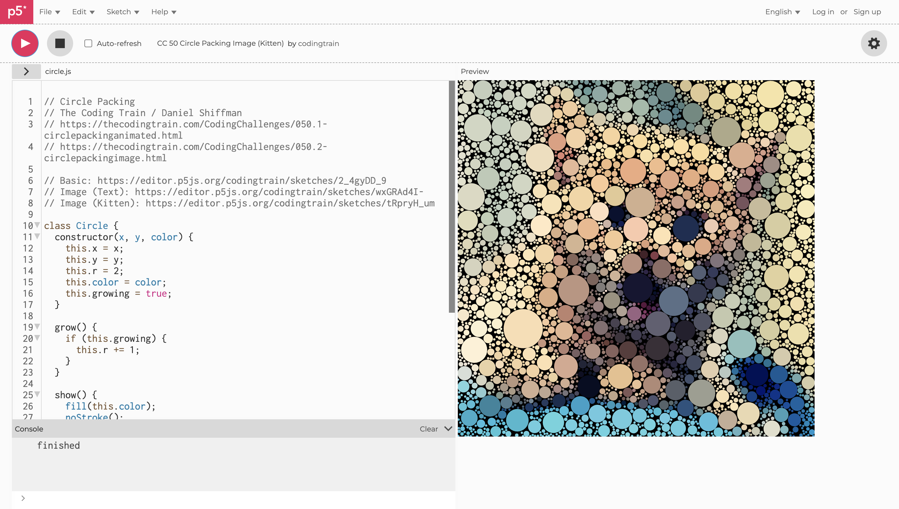
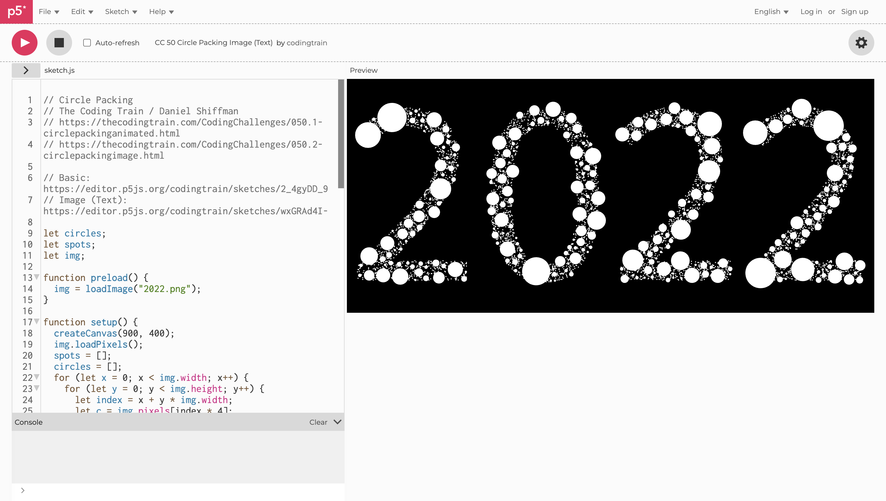

# ylan0208_9103_tut10
My first repository for IDEA9103
# Wk8 Quiz
## Imaging Technique Inspiration

I get inspirations from these works below created by a Belgian visual artist Ben Heine. He recreates iconic faces from pop culture with monochromatic flat circles only, in order to give them a dynamic 3D effect.
I think this technique could work not only for portraiture but also other artwork with colour areas in our major project selection except several works in sketches and lines only. And I am wandering if those paintings without strong contrast of light and shades can also have a nice effect by controlling the circle sizes - from Heine’s work, in general **he draws smaller circles in darker areas and larger circles in darker areas**.

## Coding Technique Exploration

I found a tutorial from _The coding Train_ YouTube Channel:
[Coding Challenge #50.1: Animated Circle Packing - Part 1](https://www.youtube.com/watch?v=QHEQuoIKgNE)

These are related coding:
1.[CC 50 Circle Packing Image (Kitten)](https://editor.p5js.org/codingtrain/sketches/tRpryH_um)

2.[CC 50 Circle Packing Image (Text)](https://editor.p5js.org/codingtrain/sketches/wxGRAd4I-)

It simply and efficiently picks the colour from uploaded image and **generates enough non-overlapping circles**, which is the foundation for implementing the image technique mentioned above. If I can set the size of the circles according to colour brightness, it can achieve a better effect.
